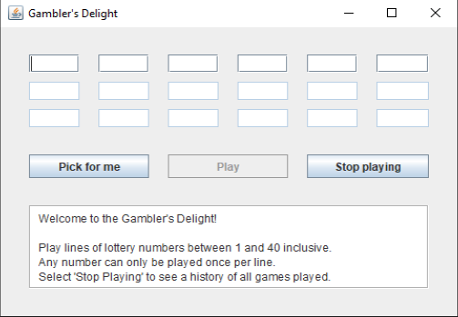

### Gambler's Delight
A lottery game with a GUI, written to learn Swing and OOP concepts. Inspired by a school project brief and using techniques from John P. Russell's lovely book *Java Programming For The Absolute Beginner* and the Oracle Swing tutorials, but all my own work.

Kevin Higgins
27/12/19

<figure>
  
  </figure
